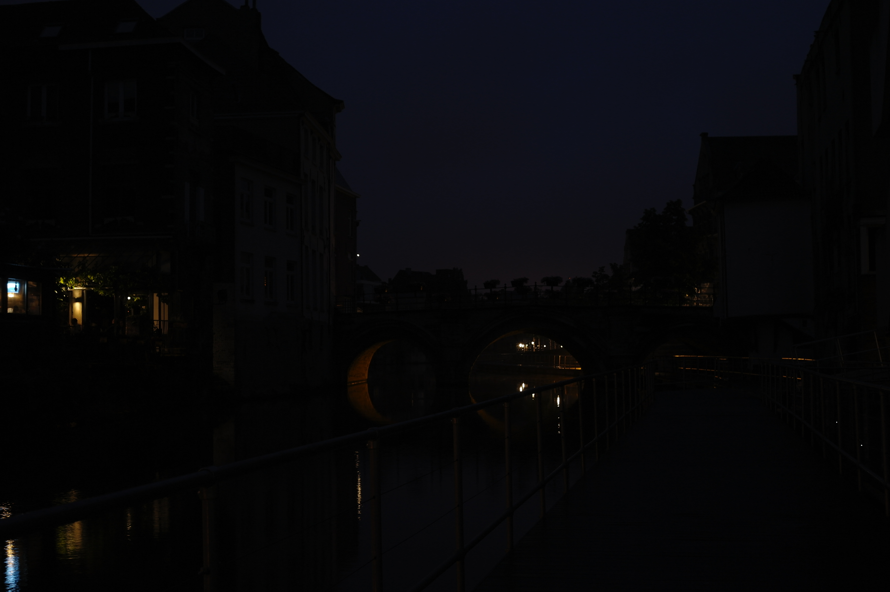

# Brightness_contrast
This project was one of my thanksgiving project, while I was waiting for my chicken to be done

This is a really simple one. This model strive to learn two parameters: alpha and beta.
Every image is then transformed by I*alpha + beta, a simple linear transformation. These two transformations are simple linear transformations that could actually change the overall contrast and brightness of a pictures.
Consider these two images, the left one is the low exposure image, and the second one is transformed using alpha = 2.019 and beta = 1.876
 

These two parameters are learned through the model. As you can see, given certain alpha and beta param, it could really change an image.
In fact, this is actually the very standard and simple way to change the brightness of an image.

The model is a simple CNNs with MaxPool downsample. It is implemented in Keras. To train the model, simply edit training.py for appropriate epoch value and training data, and use it to train.
The pre-trained weights is available at https://drive.google.com/drive/folders/1bwNq0u_7cEcdJZ0kFQnDu86JVoVo3YYP?usp=sharing